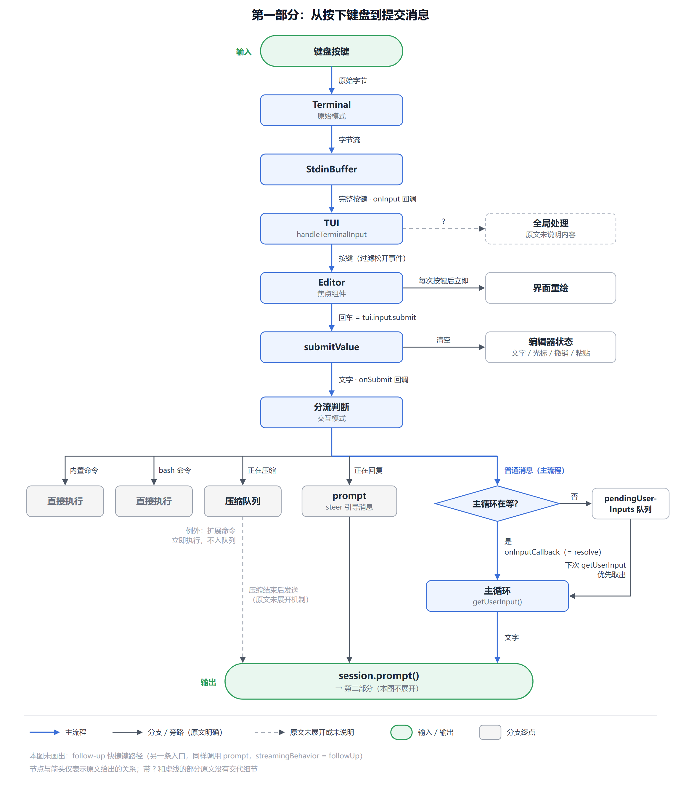

# 第一部分：从按下键盘到提交消息



## 核心结论

键盘输入经过四层传递：**终端 → TUI → 编辑器 → 交互模式**。

按下回车后，编辑器把整段文字交给交互模式。交互模式再把文字交给主循环。主循环调用 `session.prompt()`，消息从这里开始进入 agent。

这四层之间只用回调函数连接。下层不知道上层是谁，只负责调用上层登记的回调。

## 先认识几个名称

- **原始模式（raw mode）**：终端的一种工作方式。每按一个键，程序立刻收到这个键。普通模式下，终端要等你按回车才把整行交给程序。
- **转义序列（escape sequence）**：终端用一串字符表示特殊按键。例如方向键"上"是 `\x1b[A`，这三个字符代表一个按键。
- **焦点组件（focused component）**：当前接收键盘输入的界面组件。同一时刻只有一个焦点组件。
- **回调（callback）**：一个函数被先登记下来，等事件发生时再调用它。

## 一个具体例子

假设你输入 `你好`，然后按回车。

**第 1 步：终端收到原始数据。**
`Terminal.start(onInput)` 把终端切换到原始模式（`packages/tui/src/terminal.ts:174`）。之后 `process.stdin` 每收到一段数据，就交给 `StdinBuffer`。`StdinBuffer` 把数据切分成完整的按键。例如 `\x1b[A` 会被识别为一个按键，不会被拆成三个。回车键被识别为 `\r`。

**第 2 步：TUI 登记回调。**
`TUI.start()` 调用 `Terminal.start()`，并把 `handleTerminalInput` 作为 `onInput` 传进去（`packages/tui/src/tui.ts:918`）。所以终端识别出的每个按键都会进入 `handleTerminalInput`。

**第 3 步：TUI 把按键交给焦点组件。**
`handleTerminalInput()`（`tui.ts:1044`）先处理全局情况，然后执行 `this.focusedComponent.handleInput(data)`（`tui.ts:1115`）。
此时焦点组件是编辑器。按键松开事件默认被过滤掉，除非组件主动要求接收。
交给组件之后，TUI 立即重绘界面。这里不走节流定时器，因为键盘输入对延迟很敏感。

**第 4 步：编辑器识别"提交"。**
`Editor.handleInput()` 发现回车匹配了快捷键 `tui.input.submit`，于是调用 `submitValue()`（`packages/tui/src/components/editor.ts:1363`）。`submitValue()` 做三件事：

1. 把所有行拼成一个字符串，展开粘贴占位符，去掉首尾空白，得到 `"你好"`。
2. 清空编辑器状态，包括文字、光标、撤销记录和粘贴内容。
3. 调用 `this.onSubmit("你好")`。

注意：回车键是可配置的快捷键，不是写死的判断。

**第 5 步：交互模式决定如何处理这段文字。**
`onSubmit` 是在 `InteractiveMode.setupEditorSubmitHandler()` 里赋值的（`packages/coding-agent/src/modes/interactive/interactive-mode.ts:3126`）。它按顺序检查：

1. 是否是内置命令，例如 `/settings`。
2. 是否是 bash 命令，例如 `!ls`。
3. agent 是否正在压缩上下文。
4. agent 是否正在回复。
5. 以上都不是：普通消息。

`你好` 是普通消息，所以走到最后一段（`:3317`）：

```ts
if (this.onInputCallback) {
    this.onInputCallback(text);       // 主循环正在等待：直接交给它
} else {
    this.pendingUserInputs.push(text); // 主循环没在等待：先排队
}
```

**第 6 步：主循环收到文字。**
`InteractiveMode.run()` 的主循环一直停在 `await this.getUserInput()`。
`getUserInput()`（`:4150` 附近）创建一个 Promise，并把它的 `resolve` 存进 `this.onInputCallback`。第 5 步调用 `onInputCallback("你好")`，就是调用这个 `resolve`。Promise 完成，主循环继续执行：

```ts
while (true) {
    const userInput = await this.getUserInput();
    await this.session.prompt(userInput);   // 消息进入 agent
}
```

小修正：主循环里的这句 `prompt` 在 `:1227`。`:1221` 那句是启动时处理命令行传入的初始消息，不是主循环。

## 关键前提和边界

**主循环和编辑器靠 Promise 交接。**
`onInputCallback` 只在主循环等待时存在。主循环取到文字后，会立刻把它设回 `undefined`。如果用户提交时主循环还没回到等待状态，文字先进入 `pendingUserInputs` 队列。下次 `getUserInput()` 会先从队列里取，所以输入不会丢失。

**agent 正在回复时，不走主循环。**
如果 `session.isStreaming` 为真，提交的文字直接调用 `session.prompt(text, { streamingBehavior: "steer" })`。这就是引导消息（steering message）：它在当前这一轮结束后插入对话。另有一个单独的快捷键用于后续消息（follow-up），它等 agent 全部完成后才进入对话。

**agent 正在压缩上下文时，消息先排队。**
如果 `session.isCompacting` 为真，普通消息放进压缩队列，等压缩完成再发送。扩展命令例外，它们会立即执行。

**命令不会进入主循环。**
`/settings`、`!bash` 这类输入在第 5 步就被处理完了，不会成为发给模型的用户消息。

**`session.prompt()` 并不只是"发给模型"。**
它还要处理提示词模板展开、扩展命令等。这一部分属于下一阶段，也就是第二部分。

## 一句话总结

按键从终端进入，经 TUI 交给焦点编辑器。编辑器在回车时提交文字。交互模式按当前状态分流：空闲时交给主循环，回复中作为引导消息，压缩中进入队列。主循环最终调用 `session.prompt()`。

## 怎么看这张图

1. 从顶部的"键盘按键"往下读，中间那条竖线是主流程，走完终端、TUI、编辑器三层后进入"分流判断"。
2. 分流判断之后，最右边一列是普通消息的主流程，它经过主循环到达 `session.prompt()`；左边四列是分支，其中命令在这里直接结束，回复中和压缩中两种情况绕过主循环。
3. 所有路径最终只有一个输出，就是底部的 `session.prompt()`，它后面的处理属于第二部分。
